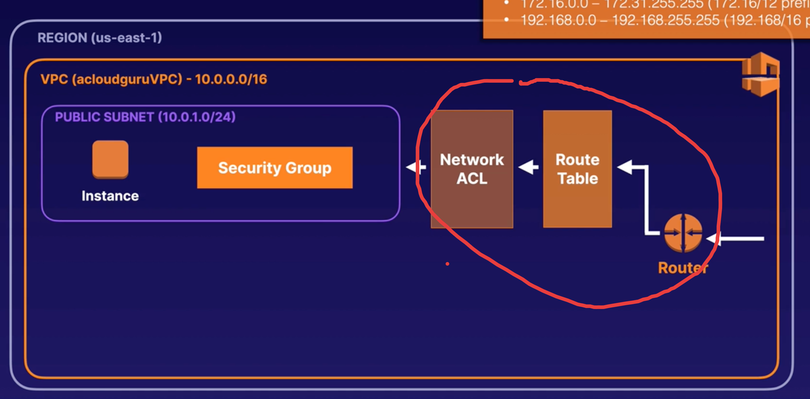
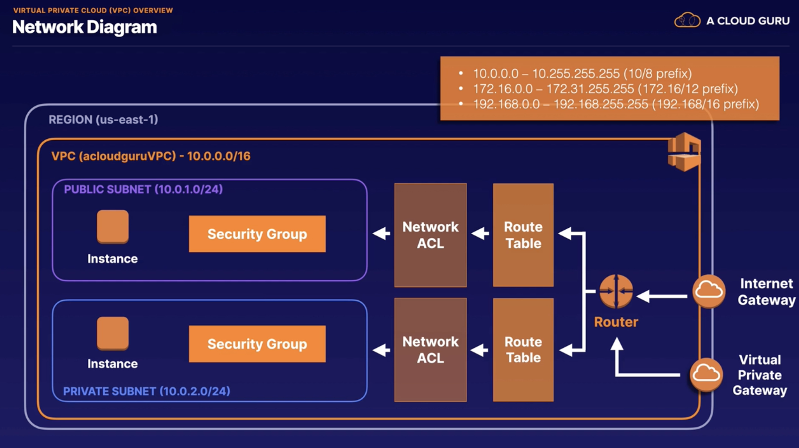

# AWS Certified Solutions Architect Associate (SAA-C03)


## Identity and Access Management (IAM)

## Simple Storage Service (S3)

## Elastic Compute Cloud (EC2)

## Elastic Block Storage (EBS) and Elastic File System (EFS)

## Databases

## Virtual Private Cloud (VPC) Networking

```
# In AWS some Ips are reserved
10.0.0.0/28  = 16
10.0.0.0/24  = 256
10.0.0.0/16  = 65536 # The largest in AWS
```
You should use
```
10.0.0.0 
172.16.0.0  
192.168.0.0
```

Will automatically be created when you create a VPC



Internet Gateway to connect to the Internet
Virtual Private Gate to connect to our own Datacenter over VPN



## Route 53

## Elastic Load Balancing (ELB)

## Monitoring

## High Availability and Scaling

## Decoupling Workflows

## Big Data

## Serverless Architecture

## Security

## Automation

## Caching

## Governance

## Migration

## Front-End Web and Mobile

## Machine Learning

## Media


##########

# AWS Certified Solutions Architect - Associate (SAA-C03)

## AWS Fundamentals

The Building Blocks of AWS: Availability Zones and Regions
Who Owns What in the Cloud?
Compute, Storage, Databases, and Networking
What Is the Well-Architected Framework?

## Identity and Access Management (IAM)
Securing the Root Account
Controlling Users' Actions with IAM Policy Documents
Permanent IAM Credentials
Introduction to AWS Identity and Access Management (IAM)
Create and Assume Roles in AWS

## Simple Storage Service (S3)

S3 Overview
Securing Your Bucket with S3 Block Public Access
Hosting a Static Website Using S3
Versioning Objects in S3
S3 Storage Classes
Lifecycle Management with S3
S3 Object Lock and Glacier Vault Lock
Encrypting S3 Objects
Optimizing S3 Performance
Backing up Data With S3 Replication

## Elastic Compute Cloud (EC2)

EC2 Overview
AWS Command Line
Using Roles
Security Groups and Bootstrap Scripts
EC2 Metadata and User Data
Networking with EC2
Optimizing with EC2 Placement Groups
Solving Licensing Issues with Dedicated Hosts
Timing Workloads with Spot Instances and Spot Fleets
Deploying vCenter in AWS with VMware Cloud on AWS
Extending AWS Beyond the Cloud with AWS Outposts
Using EC2 Roles and Instance Profiles in AWS

## Elastic Block Storage (EBS) and Elastic File System (EFS)

EBS Overview
Volumes and Snapshots
Protecting EBS Volumes with Encryption
EC2 Hibernation
EFS Overview
FSx Overview
Amazon Machine Images: EBS vs. Instance Store
AWS Backup
Reduce Storage Costs with EFS

## Databases

Relational Database Service (RDS) Overview
Increasing Read Performance with Read Replicas
What Is Amazon Aurora?
DynamoDB Overview
When Do We Use DynamoDB Transactions?
Saving Your Data with DynamoDB Backups
Taking Your Data Global with DynamoDB Streams and Global Tables
Operating MongoDB-Compatible Databases in Amazon DocumentDB
Running Apache Cassandra Workloads with Amazon Keyspaces
Implementing Graph Databases Using Amazon Neptune
Leveraging Amazon Quantum Ledger Database (Amazon QLDB) for Ledger Databases
Analyzing Time-Series Data with Amazon Timestream
Set Up a WordPress Site Using EC2 and RDS

## Virtual Private Cloud (VPC) Networking

VPC Overview
Using NAT Gateways for Internet Access
Protecting Your Resources with Security Groups
Controlling Subnet Traffic with Network ACLs
Private Communication Using VPC Endpoints
Building Solutions across VPCs with Peering
Network Privacy with AWS PrivateLink
Securing Your Network with VPN CloudHub
Connecting On-Premises with Direct Connect
Simplifying Networks with Transit Gateway
5G Networking with AWS Wavelength
VPC Networking Exam Tips


xxxxxxxxxxxxx
08:40
HANDS-ON LAB
Build Solutions across VPCs with Peering
1:00:00
QUIZ
AWS Certified Solutions Architect - Associate (SAA-C03) - Virtual Private Cloud (VPC) Networking Quiz
15:00
CHAPTER 9

Route 53
1:21:48

Route 53 Overview
14:25


Register a Domain Name
07:57

Demo: Using a Simple Routing Policy
THIS MONTH

NEW
04:28
Demo: Using a Weighted Routing Policy
09:14

Demo: Using a Failover Routing Policy
THIS MONTH

NEW
05:33

Demo: Using a Geolocation Routing Policy
03:42
Demo: Using a Geoproximity Routing Policy
THIS MONTH

NEW
05:03
Demo: Using a Latency Routing Policy
05:42
Demo: Using a Multivalue Answer Routing Policy
THIS MONTH

NEW
03:33
Route 53 Exam Tips
07:11
QUIZ
AWS Certified Solutions Architect - Associate (SAA-C03) - Route 53 Quiz
15:00
CHAPTER 10

Elastic Load Balancing (ELB)
1:53:19

ELB Overview
04:13


Using Application Load Balancers
15:20

Extreme Performance with Network Load Balancers
03:29
Using the Classic Load Balancer
06:36
Getting "Stuck" with Sticky Sessions
02:26
Leaving the Load Balancer with Deregistration Delay
02:25
ELB Exam Tips
03:50

HANDS-ON LAB
Use Application Load Balancers for Web Servers
1:00:00
QUIZ
AWS Certified Solutions Architect - Associate (SAA-C03) - Load Balancing Quiz
15:00
CHAPTER 11

Monitoring
2:55:20

CloudWatch Overview
14:57


Application Monitoring with CloudWatch Logs
12:55

Monitoring with Amazon Managed Service for Prometheus and Amazon Managed Grafana
07:56
Monitoring Exam Tips
04:32


HANDS-ON LAB
Implement Advanced CloudWatch Monitoring for a Web Server
30:00
HANDS-ON LAB
Work with AWS VPC Flow Logs for Network Monitoring
1:30:00
QUIZ
AWS Certified Solutions Architect - Associate (SAA-C03) - Monitoring Quiz
15:00
CHAPTER 12

High Availability and Scaling
1:40:46

Horizontal vs. Vertical Scaling Overview
05:59
What Are Launch Templates and Launch Configurations?
10:57
Scaling EC2 Instances with Auto Scaling
17:19


Diving Deeper into Auto Scaling Policies
17:56
Scaling Relational Databases
12:35
Scaling Non-Relational Databases
10:04
High Availability and Scaling Exam Tips
10:56

QUIZ
AWS Certified Solutions Architect - Associate (SAA-C03) - HA and Scaling Quiz
15:00
CHAPTER 13

Decoupling Workflows
2:10:02

Decoupling Workflows Overview
08:35
Messaging with SQS
14:59

Sidelining Messages with Dead-Letter Queues
12:25
Ordered Messages with SQS FIFO
12:01
Delivering Messages with SNS
15:21


Fronting Applications with API Gateway
10:35
Executing Batch Workloads Using AWS Batch
12:12


Brokering Messages with Amazon MQ
06:02


Coordinating Distributed Apps with AWS Step Functions
08:52
Ingesting Data from SaaS Applications to AWS with Amazon AppFlow
06:54
Decoupling Workflows Exam Tips
07:06

QUIZ
AWS Certified Solutions Architect - Associate (SAA-C03) - Decoupling Workflows Quiz
15:00
CHAPTER 14

Big Data
1:17:54

Exploring Large Redshift Databases
09:42

Processing Data with EMR (Elastic MapReduce)
07:59
Streaming Data with Kinesis
09:05
Amazon Athena and AWS Glue
06:23
Visualizing Data with QuickSight
04:53
Moving Transformed Data Using AWS Data Pipeline
07:19
Implementing Amazon Managed Streaming for Apache Kafka (Amazon MSK)
06:47
Analyzing Data with Amazon OpenSearch Service
04:35

Big Data Exam Tips
06:11


QUIZ
AWS Certified Solutions Architect - Associate (SAA-C03) - Big Data Quiz
15:00
CHAPTER 15

Serverless Architecture
2:50:29

Serverless Overview
06:46
Computing with Lambda
16:45

Leveraging the AWS Serverless Application Repository
03:37
Container Overview
11:26
Running Containers in ECS or EKS
13:14

Removing Servers with Fargate
13:38
Amazon EventBridge (CloudWatch Events)
08:48
Storing Custom Docker Images in Amazon Elastic Container Registry (Amazon ECR)
06:29
Using Open-Source Kubernetes in Amazon EKS Distro
01:56
Orchestrating Containers Outside AWS Using Amazon ECS Anywhere and Amazon EKS Anywhere
08:04
Auto Scaling Databases On Demand with Amazon Aurora Serverless
06:02
Using AWS X-Ray for Application Insights
06:18
Deploying GraphQL Interfaces in AWS AppSync
01:59
Serverless Architecture Exam Tips
05:27
HANDS-ON LAB
Triggering AWS Lambda from Amazon SQS
45:00
QUIZ
AWS Certified Solutions Architect - Associate (SAA-C03) - Serverless Architecture Quiz
15:00
CHAPTER 16

Security
2:41:05

DDoS Overview
05:38
Logging API Calls with CloudTrail
03:27


Protecting Applications with Shield
03:55


Filtering Traffic with AWS WAF
03:17
Guarding Your Network with GuardDuty
02:55
Centralizing WAF Management via AWS Firewall Manager
01:46
Monitoring S3 Buckets with Macie
04:04
Securing Operating Systems with Inspector
03:01
Managing Encryption Keys with KMS and CloudHSM
07:58


Storing Your Secrets in Secrets Manager
03:04
Storing Your Secrets in Parameter Store
01:38
Temporarily Sharing S3 Objects Using Presigned URLs or Cookies
05:39
Advanced IAM Policy Documents
09:11
AWS Certificate Manager
02:20
Auditing Continuously with AWS Audit Manager
01:52
Downloading Compliance Documents from AWS Artifact
02:10
Authenticating Access with Amazon Cognito
05:21
Analyzing Root Cause Using Amazon Detective
02:47
Protecting VPCs with AWS Network Firewall
02:36
Leveraging AWS Security Hub for Collecting Security Data
01:23
Security Exam Tips
12:03
HANDS-ON LAB
Using Secrets Manager to Authenticate with an RDS Database Using Lambda
1 MONTH AGO

UPDATED
1:00:00
QUIZ
AWS Certified Solutions Architect - Associate (SAA-C03) - Security Quiz
15:00
CHAPTER 17

Automation
2:08:57

Why Do We Automate?
10:04
CloudFormation
14:19

Elastic Beanstalk
10:48

Systems Manager
11:33

Automation Exam Tips
07:13
HANDS-ON LAB
Getting Started with CloudFormation
1:00:00
QUIZ
AWS Certified Solutions Architect - Associate (SAA-C03) - Automation Quiz
15:00
CHAPTER 18

Caching
1:00:16

Caching Overview
06:26
Global Caching with CloudFront
11:27
Caching Your Data with ElastiCache and DAX
07:52
Fixing IP Caching with Global Accelerator
11:22
Caching Exam Tips
08:09


QUIZ
AWS Certified Solutions Architect - Associate (SAA-C03) - Cache (Lowering Latency) Quiz
15:00
CHAPTER 19

Governance
2:58:37

Managing Accounts with Organizations
12:20

Sharing Resources with AWS RAM
10:32
Setting Up Cross-Account Role Access
07:39
Inventory Management with AWS Config
10:19
Offloading Active Directory to Directory Service
04:57
Exploring with Cost Explorer
08:19
Using AWS Budgets
09:13
Optimizing Costs with AWS Cost and Usage Reports
03:38


Reducing Compute Spend Using Savings Plans and AWS Compute Optimizer
08:40
Auditing with Trusted Advisor
08:12
Enforcing Account Governance via AWS Control Tower
08:43
Managing Software Licenses in AWS with AWS License Manager
02:44
Monitoring Health Events in the AWS Personal Health Dashboard
06:12
Standardizing Deployments Using AWS Service Catalog and AWS Proton
04:52
Optimizing Architectures with the AWS Well-Architected Tool
03:21
Governance Exam Tips
08:56


HANDS-ON LAB
Creating AWS Tags and Resource Groups
1 MONTH AGO

UPDATED
45:00
QUIZ
AWS Certified Solutions Architect - Associate (SAA-C03) - Governance Quiz
15:00
CHAPTER 20

Migration
1:20:50

Migrating Data with AWS Snow Family
09:27
Storage Gateway
07:48


AWS DataSync
05:15


AWS Transfer Family
04:57
Moving to the Cloud with Migration Hub
08:01
Migrating Workloads to AWS Using AWS Application Discovery Service or AWS Application Migration Service (AWS MGN)
06:56
Migrating Databases from On-Premises to AWS with AWS Database Migration Service (AWS DMS)
10:17
Replicating and Tracking Migrations with AWS Migration Hub and AWS Server Migration Service (AWS SMS)
05:48
Migration Exam Tips
07:21
QUIZ
AWS Certified Solutions Architect - Associate (SAA-C03) - Migration Quiz
15:00
CHAPTER 21

Front-End Web and Mobile
29:24

Front-End Web and Mobile Overview
01:04
Quickly Deploying Web Apps with AWS Amplify
03:47
Testing App Services Using AWS Device Farm
01:56
Engaging Customers with Amazon Pinpoint
04:17
Front-End Web and Mobile Exam Tips
03:20
QUIZ
AWS Certified Solutions Architect - Associate (SAA-C03) - Front-End Web and Mobile Quiz
15:00
CHAPTER 22

Machine Learning
51:49

Machine Learning Overview
01:37
Analyzing Text Using Amazon Comprehend, Amazon Kendra, and Amazon Textract
06:06
Predicting Time-Series Data Using Amazon Forecast
02:35
Protecting Accounts with Amazon Fraud Detector
01:55
Working with Text and Speech Using Amazon Polly, Amazon Transcribe, and Amazon Lex
05:16
Analyzing Images via Amazon Rekognition
03:39
Leveraging Amazon SageMaker to Train Learning Models
08:17
Translating Content into Different Languages with Amazon Translate
01:49
Machine Learning Exam Tips
05:35
QUIZ
AWS Certified Solutions Architect - Associate (SAA-C03) - Machine Learning Quiz
15:00
CHAPTER 23

Media
21:16

Media Overview
00:41
Converting Media Files with Amazon Elastic Transcoder
01:51
Streaming Live Video in AWS Using Amazon Kinesis Video Streams
02:35
Media Exam Tips
01:09
QUIZ
AWS Certified Solutions Architect - Associate (SAA-C03) - Media Quiz
15:00
CHAPTER 24

Exam Preparation
10:37:43

Revision for Success
10:42

Tackling Exam Questions
11:20
Booking Your Certification Exam
09:27
Preparing for Remote Proctored Exams
06:14

PRACTICE EXAM
AWS Certified Solutions Architect - Associate (SAA-C03) - Practice Exam 1
2:00:00
PRACTICE EXAM
AWS Certified Solutions Architect - Associate (SAA-C03) - Practice Exam 2
2:00:00
PRACTICE EXAM
AWS Certified Solutions Architect - Associate (SAA-C03) - Practice Exam 3
2:00:00
PRACTICE EXAM
AWS Certified Solutions Architect - Associate (SAA-C03) - Practice Exam 4
2:00:00
PRACTICE EXAM
AWS Certified Solutions Architect - Associate (SAA-C03) - Practice Exam 5
2:00:00
CHAPTER 25

Conclusion
01:02

Conclusion
01:02
Your Progress
0%

COMPLETE

Lesson Completion

0%

Lab Completion

0 of 17

Quiz Completion

0 of 23

NEW

Learning Scheduler
Tell us how many hours per week you can study.

4
18 Jan.
HRS PER WEEKCOMPLETION DATE
MEMBERS ONLY

Practice Exams
This course has multiple practice exams, giving you more opportunity to build your confidence.

MEMBERS ONLY

Cloud Playground
Cloud along in real time. This course supports Cloud Playground sandbox environments, so you can learn by doing in a real cloud environment.

Certificate of Completion
Complete at least 80% of the course before you can request a certificate of completion.

Rate this course
Loved it? Room for improvement? Let us know!

© 2023 A Cloud Guru
Privacy Policy
Terms of Use
Careers
Blog
Manage my account
Support


Follow us on Twitter
Follow us on Facebook
Follow us on Instagram
Follow us on LinkedIn
A Cloud Guru

